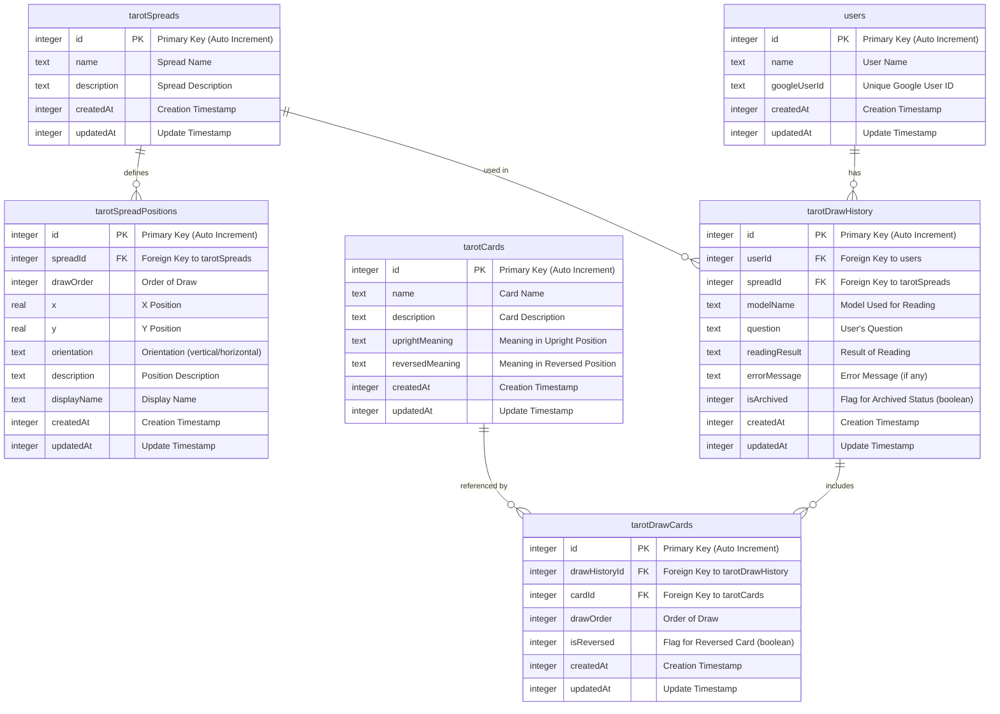

```mermaid
erDiagram
    users {
        integer id PK "Primary Key (Auto Increment)"
        text name "User Name"
        text googleUserId "Unique Google User ID"
        integer createdAt "Creation Timestamp"
        integer updatedAt "Update Timestamp"
    }

    tarotSpreads {
        integer id PK "Primary Key (Auto Increment)"
        text name "Spread Name"
        text description "Spread Description"
        integer createdAt "Creation Timestamp"
        integer updatedAt "Update Timestamp"
    }

    tarotSpreadPositions {
        integer id PK "Primary Key (Auto Increment)"
        integer spreadId FK "Foreign Key to tarotSpreads"
        integer drawOrder "Order of Draw"
        real x "X Position"
        real y "Y Position"
        text orientation "Orientation (vertical/horizontal)"
        text description "Position Description"
        text displayName "Display Name"
        integer createdAt "Creation Timestamp"
        integer updatedAt "Update Timestamp"
    }

    tarotCards {
        integer id PK "Primary Key (Auto Increment)"
        text name "Card Name"
        text description "Card Description"
        text uprightMeaning "Meaning in Upright Position"
        text reversedMeaning "Meaning in Reversed Position"
        integer createdAt "Creation Timestamp"
        integer updatedAt "Update Timestamp"
    }

    tarotDrawHistory {
        integer id PK "Primary Key (Auto Increment)"
        integer userId FK "Foreign Key to users"
        integer spreadId FK "Foreign Key to tarotSpreads"
        text modelName "Model Used for Reading"
        text question "User's Question"
        text readingResult "Result of Reading"
        text errorMessage "Error Message (if any)"
        integer isArchived "Flag for Archived Status (boolean)"
        integer createdAt "Creation Timestamp"
        integer updatedAt "Update Timestamp"
    }

    tarotDrawCards {
        integer id PK "Primary Key (Auto Increment)"
        integer drawHistoryId FK "Foreign Key to tarotDrawHistory"
        integer cardId FK "Foreign Key to tarotCards"
        integer drawOrder "Order of Draw"
        integer isReversed "Flag for Reversed Card (boolean)"
        integer createdAt "Creation Timestamp"
        integer updatedAt "Update Timestamp"
    }

    %% Relationships
    users ||--o{ tarotDrawHistory : "has"
    tarotSpreads ||--o{ tarotSpreadPositions : "defines"
    tarotSpreads ||--o{ tarotDrawHistory : "used in"
    tarotDrawHistory ||--o{ tarotDrawCards : "includes"
    tarotCards ||--o{ tarotDrawCards : "referenced by"

```
