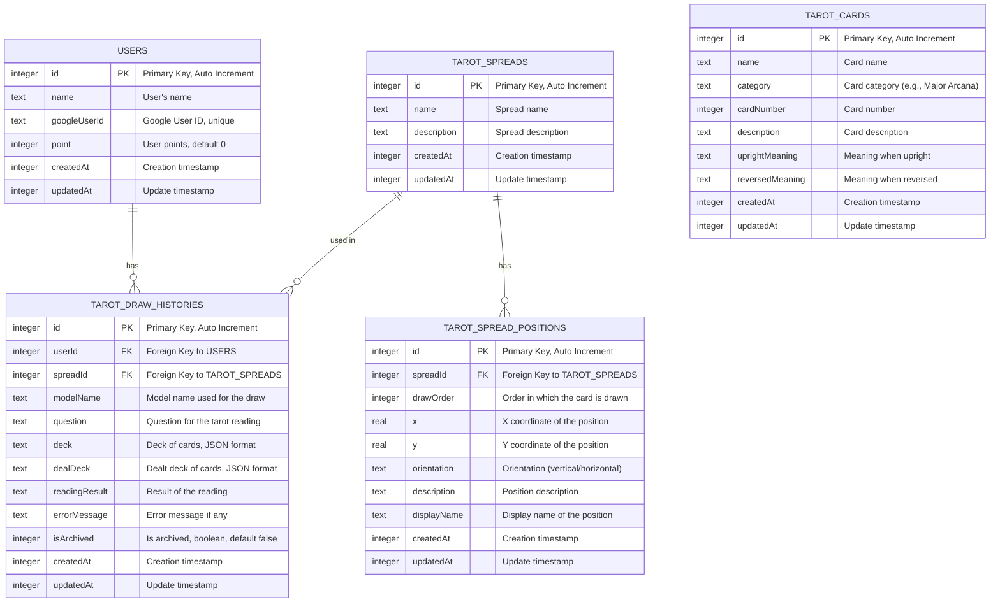

```mermaid
erDiagram
    USERS {
        integer id PK "Primary Key, Auto Increment"
        text name "User's name"
        text googleUserId "Google User ID, unique"
        integer point "User points, default 0"
        integer createdAt "Creation timestamp"
        integer updatedAt "Update timestamp"
    }

    TAROT_SPREADS {
        integer id PK "Primary Key, Auto Increment"
        text name "Spread name"
        text description "Spread description"
        integer createdAt "Creation timestamp"
        integer updatedAt "Update timestamp"
    }

    TAROT_SPREAD_POSITIONS {
        integer id PK "Primary Key, Auto Increment"
        integer spreadId FK "Foreign Key to TAROT_SPREADS"
        integer drawOrder "Order in which the card is drawn"
        real x "X coordinate of the position"
        real y "Y coordinate of the position"
        text orientation "Orientation (vertical/horizontal)"
        text description "Position description"
        text displayName "Display name of the position"
        integer createdAt "Creation timestamp"
        integer updatedAt "Update timestamp"
    }

    TAROT_CARDS {
        integer id PK "Primary Key, Auto Increment"
        text name "Card name"
        text category "Card category (e.g., Major Arcana)"
        integer cardNumber "Card number"
        text description "Card description"
        text uprightMeaning "Meaning when upright"
        text reversedMeaning "Meaning when reversed"
        integer createdAt "Creation timestamp"
        integer updatedAt "Update timestamp"
    }

    TAROT_DRAW_HISTORIES {
        integer id PK "Primary Key, Auto Increment"
        integer userId FK "Foreign Key to USERS"
        integer spreadId FK "Foreign Key to TAROT_SPREADS"
        text modelName "Model name used for the draw"
        text question "Question for the tarot reading"
        text deck "Deck of cards, JSON format"
        text dealDeck "Dealt deck of cards, JSON format"
        text readingResult "Result of the reading"
        text errorMessage "Error message if any"
        integer isArchived "Is archived, boolean, default false"
        integer createdAt "Creation timestamp"
        integer updatedAt "Update timestamp"
    }

    USERS ||--o{ TAROT_DRAW_HISTORIES : "has"
    TAROT_SPREADS ||--o{ TAROT_SPREAD_POSITIONS : "has"
    TAROT_SPREADS ||--o{ TAROT_DRAW_HISTORIES : "used in"
```
