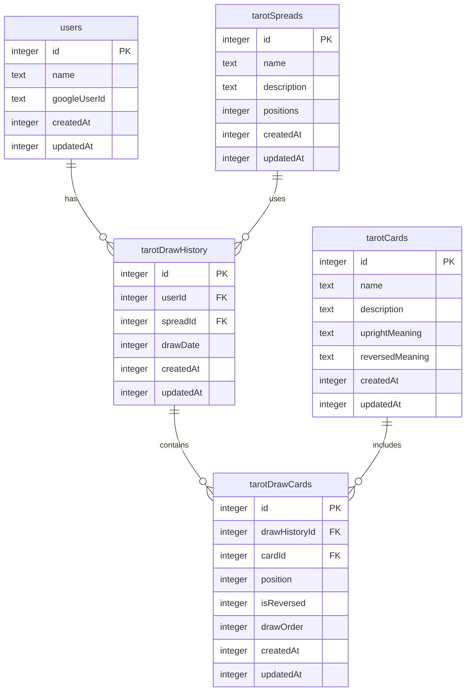

```mermaid
erDiagram
    users {
        integer id PK
        text name
        text googleUserId
        integer createdAt
        integer updatedAt
    }

    tarotSpreads {
        integer id PK
        text name
        text description
        integer positions
        integer createdAt
        integer updatedAt
    }

    tarotCards {
        integer id PK
        text name
        text description
        text uprightMeaning
        text reversedMeaning
        integer createdAt
        integer updatedAt
    }

    tarotDrawHistory {
        integer id PK
        integer userId FK
        integer spreadId FK
        integer drawDate
        integer createdAt
        integer updatedAt
    }

    tarotDrawCards {
        integer id PK
        integer drawHistoryId FK
        integer cardId FK
        integer position
        integer isReversed
        integer drawOrder
        integer createdAt
        integer updatedAt
    }

    users ||--o{ tarotDrawHistory : "has"
    tarotSpreads ||--o{ tarotDrawHistory : "uses"
    tarotDrawHistory ||--o{ tarotDrawCards : "contains"
    tarotCards ||--o{ tarotDrawCards : "includes"
```